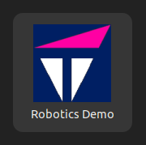

# Launcher Instructions
Open the launcher folder:
```cd launcher```

Edit ```launch_robotics_demo.sh``` to include your board's IP address on **line 9**

Run the launcher:
```chmod +x install_launcher.sh```
```./install_launcher.sh```

You can now:
1. Find 'Robotics Demo' in your applications menu

2. Run it directly: ~/launch_robotics_demo.sh"

While running, it will open a second terminal to launch demo Part 2 (this launches the Gazebo simulation running on the Host PC).
The first terminal will ask for your Vision AI Kit's password and continue setup until it launches Part 1 of the demo (this launches the Flask app running on the Vision AI Kit).

Open the flask app in a browser window by navigating to ```[Vision AI Kit 6490 IP address]:5000```
Position the Gazebo environment on top of the flask app. 